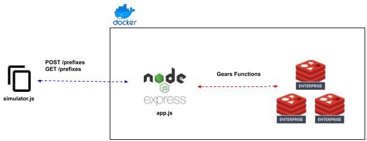
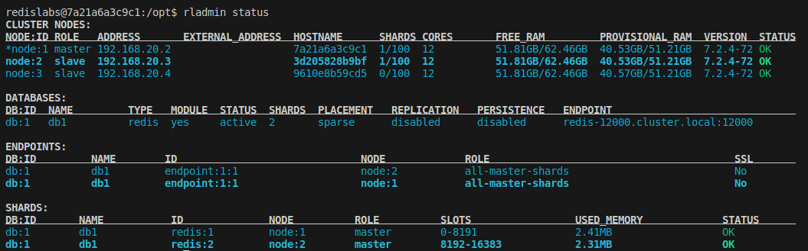
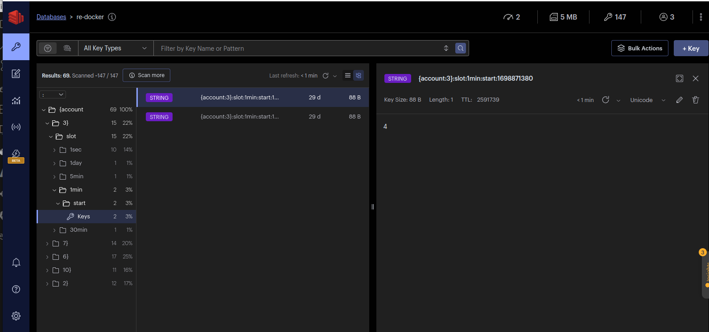

# Time-slot Counter Demo

## Contents
1.  [Summary](#summary)
2.  [Architecture](#architecture)
3.  [Approach](#approach)
4.  [Features](#features)
5.  [Prerequisites](#prerequisites)
6.  [Installation](#installation)
7.  [Usage](#usage)


## Summary <a name="summary"></a>
This is a Javascript-based demo of the Redis Gears 2.0 Functions. A Redis Function is deployed that provides time slot counters at the 1 sec, 1 min, 5 min, 30 min and 1 day level for any given key.  A REST API server implemented in Express JS provides client access to the function for increments and fetches of counters.  Finally, a Javascript function is provided to simulate and time execution of random read/write operations on the counters. 

## Architecture <a name="architecture"></a>
  

## Approach <a name="approach"></a>
A Redis Function library (server-side) provides the bulk of the functionality of this demonstration.  That library provides 2 functions:  increment and fetch.  The increment function will update the associated timeslot counters (1 sec, 1 min, 5 min, 30 min, 1 day) for any given key.  The fetch function will retrieve those counters for a key and a given time slot.

## Features <a name="features"></a>
- Redis 2.0 Gears Functions, ExpressJS-based REST API server, simulator.

## Prerequisites <a name="prerequisites"></a>
- Docker
- Docker Compose

## Installation <a name="installation"></a>
```bash
git clone https://github.com/joeywhelan/ts-counter.git && cd ts-counter
```

## Usage <a name="usage"></a>
### Demo start-up
```bash
./start.sh
```
### Demo shutdown
```bash
./stop.sh
```

## Sample Results <a name="results"></a>
### rladmin status
  

### RedisInsight
  

### Simulator
```bash
100 iterations of random read/write operations at random time intervals (1 ms - 1 sec)
Ave Write Latency: 2.12 ms
Ave Read Latency:  1.82 ms
```